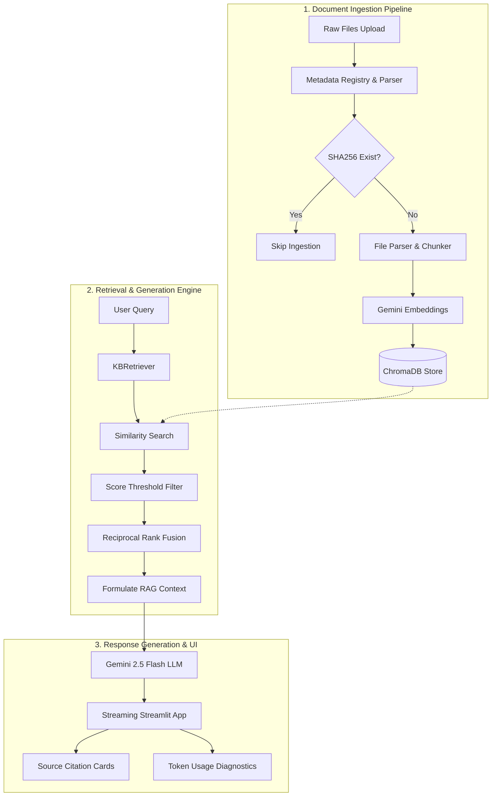

# Company Knowledge Base Q&A RAG System

A production-grade, enterprise-ready Retrieval-Augmented Generation (RAG) system built with **LlamaIndex**, **Gemini 2.5 Flash**, **ChromaDB**, and **Streamlit**. This system allows organizations to ingest local documents (PDF, Docx, PPTX, Text) and conduct interactive Q&A sessions with secure source citations, robust caching, duplicate detection, and structured logging.

---

## 🏗️ Architecture Diagram

The diagram below illustrates the ingestion pipeline, the retrieval & ensembling layer, and the query/response loop:



---

## ✨ Features

- **Document Ingestion:** Support for multiple formats (PDF, DOCX, PPTX, TXT) via unified parsing pipelines.
- **Duplicate Prevention:** Automatic file hashing (SHA256) checked against a persistent registry before vectorization.
- **Provider Abstraction:** OOP adapters (`EmbeddingProvider` & `VectorStoreProvider`) following the **Dependency Inversion Principle**, facilitating easy migration to Pinecone, OpenAI, etc.
- **Hybrid Retrieval & Scoring:** Reciprocal Rank Fusion (RRF) ensembling, similarity score logging, and score-threshold pruning.
- **Production-grade Logging:** Colorized console logging for developers and structured JSON logging (`logs/app.log`) for APM ingestion (e.g., Datadog, ELK).
- **Streamlit Interface:** High-fidelity dark mode interface with loading animations, sidebar configuration parameters, persistent session history, health checks, and responsive layouts.
- **Docker Orchestration:** Multi-stage production Docker build and health-monitored Docker Compose orchestration.
- **RAGAS Evaluation:** Evaluation stubs measuring Faithfulness, Answer Relevance, and Context Precision.

---

## 🛠️ Tech Stack

- **RAG Orchestrator:** `LlamaIndex`
- **Large Language Model:** Gemini 2.5 Flash (`gemini-2.5-flash`)
- **Embedding Model:** Gemini Text Embedding (`models/gemini-embedding-001`)
- **Vector Database:** `ChromaDB` (persistent local storage)
- **Frontend / UI:** `Streamlit`
- **Evaluation:** `RAGAS`
- **Environment & Settings:** `pydantic-settings` & `python-dotenv`
- **Logging:** `Loguru`
- **DevOps:** `Docker` & `Docker Compose`
- **Quality Assurance:** `pytest`, `mypy` (static types), `ruff` (linter/formatter)

---

## 📂 Folder Structure

```text
company-knowledge-base-rag/
├── .env                  # Environment configuration (gitignored)
├── .env.example          # Sample environment variables config
├── .gitignore            # Git exclusion patterns
├── Dockerfile            # Multi-stage production container build
├── LICENSE               # MIT License file
├── README.md             # Project documentation
├── app.py                # Main Streamlit web application
├── requirements.txt      # Pinned pip dependencies list
├── config/
│   ├── exceptions.py     # Custom exception definitions
│   ├── logging_config.py # Loguru dual-logger setup (text & JSON)
│   └── settings.py       # Pydantic-settings config validation
├── data/
│   ├── chromadb/         # Local ChromaDB vector database files
│   ├── processed/        # Processed metadata tracking JSON database
│   └── raw/              # Saved raw document uploads
├── docker/
│   └── docker-compose.yml# Docker orchestration manifest
├── embeddings/
│   └── embedding_model.py# Embeddings Provider abstraction & Gemini implementation
├── evaluation/
│   └── ragas_eval.py     # Ragas evaluation framework stubs
├── ingestion/
│   ├── chunker.py        # SentenceSplitter chunk config
│   ├── loader.py         # Directory reader & metadata parsing
│   ├── metadata_registry.py # SHA256 duplicate detection & registry
│   └── parser.py         # File parser registration maps
├── logs/
│   └── app.log           # Output JSON formatted structured log file
├── rag/
│   ├── index_builder.py  # Ingestion & index builder orchestrator
│   ├── query_engine.py   # Citation parser & conversation memory
│   └── retriever.py      # Search retrieval & score logger
├── tests/
│   ├── test_logging.py   # Loguru output unit tests
│   └── test_settings.py  # Pydantic settings schema unit tests
└── utils/
    └── health_check.py   # Gemini, Chroma, Storage path healthchecks
```

---

## 🚀 Setup and Installation

### 1. Prerequisites
- **Python 3.12+**
- Gemini API Key (get one from [Google AI Studio](https://aistudio.google.com/))

### 2. Local Installation
Clone the repository and install dependencies inside a virtual environment:
```bash
# Create and activate virtual environment
python -m venv .venv
source .venv/bin/activate  # On Windows: .venv\Scripts\activate

# Install dependencies
pip install -r requirements.txt
```

---

## ⚙️ Environment Variables

Copy the `.env.example` file to `.env`:
```bash
cp .env.example .env
```

Configure the following variables inside `.env`:
| Variable | Description | Default |
|---|---|---|
| `GEMINI_API_KEY` | Your Google Gemini API Key | `None` (Required) |
| `MODEL_PROVIDER` | LLM service provider | `gemini` |
| `EMBEDDING_PROVIDER` | Embedding service provider | `gemini` |
| `LLM_MODEL` | Gemini LLM name | `gemini-2.5-flash` |
| `EMBEDDING_MODEL` | Gemini embedding model | `models/gemini-embedding-001` |
| `CHROMA_DB_PATH` | Storage directory for ChromaDB | `./data/chromadb` |
| `CHROMA_COLLECTION_NAME` | Name of Chroma collection | `company_knowledge_base` |
| `DATA_RAW_DIR` | Directory for raw uploaded documents | `./data/raw` |
| `DATA_PROCESSED_DIR` | Directory for registry metadata | `./data/processed` |
| `CHUNK_SIZE` | Size of document chunks | `512` |
| `CHUNK_OVERLAP` | Overlap between consecutive chunks | `50` |
| `LOG_LEVEL` | Application log visibility level | `INFO` |
| `LOG_FILE_PATH` | Path to production log file | `./logs/app.log` |

---

## 💻 Running Locally

### Start UI
To run the Streamlit portal locally:
```bash
streamlit run app.py
```
Open your browser to `http://localhost:8501`.

### Run Tests
The repository includes a comprehensive `pytest` suite testing all levels of configurations, loaders, embeddings, retrievers, query engines, and evaluation pipelines:
```bash
python -m pytest
```

---

## 🐳 Docker Usage

You can build and deploy the application in isolated containers.

### 1. Run using Docker Compose (Recommended)
This method spins up the container and maps host directories for persistent database and log storage.
```bash
cd docker
docker-compose up --build
```

### 2. Build the Dockerfile directly
```bash
docker build -t company-knowledge-base-rag .
docker run -p 8501:8501 --env-file .env company-knowledge-base-rag
```

---

## 📊 Evaluation with RAGAS

The project integrates with the **RAGAS** evaluation framework. The pipeline evaluates the system based on:
1. **Faithfulness:** Assesses if the generated response is based on the retrieved context.
2. **Answer Relevance:** Evaluates if the response addresses the prompt.
3. **Context Precision:** Measures if the retrieved context is relevant.

To execute evaluation runs:
```bash
python -m pytest tests/test_evaluation.py
```

---

## 🗺️ Future Roadmap

- [ ] **Multi-vector Store Support:** Integrate Pinecone/Weaviate vector indexes.
- [ ] **Hybrid Search Tuning:** Expose slider weights for keyword BM25 vs dense embeddings search directly in Streamlit.
- [ ] **Auto-metadata Tagging:** Implement LlamaIndex metadata extractors using LLM to auto-tag department, document type, and creation date.
- [ ] **Role-based Access Control (RBAC):** Restrict document queries based on user active directory/OAuth groups.
- [ ] **Advanced Re-ranking:** Add Cohere or BGE re-rankers to optimize the top-K context fed to the LLM.
