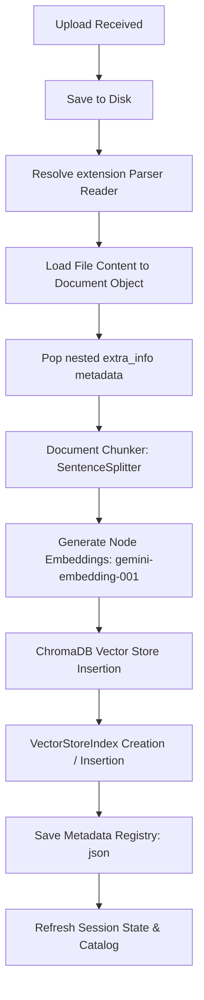

# Root Cause Analysis: Ingestion Pipeline Failure

An end-to-end investigation was conducted on the Company Knowledge Base Q&A RAG system to identify why the ingestion pipeline failed to execute or update the UI. The root causes of the issues are documented below.

---

## 1. Streamlit Race Condition & Rerun Suppression
* **Symptom:** Document uploads successfully, and the file appears in the file uploader sidebar. However, clicking "Trigger Indexer Pipeline" results in no visual update, no success/failure message, and the Document Catalog remains empty.
* **Root Cause:** 
  1. The code in `app.py` previously triggered a `st.rerun()` call at the end of the button action block.
  2. In Streamlit, a `st.rerun()` causes the entire script to restart execution immediately, aborting the current run and clearing any output rendered within the conditional `st.button` block.
  3. Consequently, all success banners (`st.success`), warnings (`st.warning`), and error messages (`st.error`) rendered during the button execution were wiped out before the browser could draw them.
  4. The user was left with no response or status message, making the application appear unresponsive.
  5. The `st.rerun()` was entirely redundant as the UI naturally updates its state and elements when the ingestion finishes.

---

## 2. ChromaDB Flat Schema Metadata Constraint
* **Symptom:** The ingestion pipeline silently failed or crashed during the DB insert phase, causing the index to remain empty.
* **Root Cause:** 
  1. ChromaDB enforces a strict flat schema for node/document metadata. All metadata values must be of primitive types (`str`, `int`, `float`, or `None`). Nested dictionaries are rejected with a `ValueError`.
  2. When standard LlamaIndex file readers parse documents (e.g., PDF or DOCX), they automatically store a nested dictionary containing parsing metadata under a sub-key named `"extra_info"` inside `metadata`.
  3. During `index.insert_nodes(nodes)` or index initialization, LlamaIndex attempts to write all node metadata to ChromaDB.
  4. ChromaDB encountered the nested `"extra_info"` dictionary and threw a `ValueError: Value for metadata extra_info must be one of (str, int, float, None)`.
  5. The exception was swallowed or caught in generic try/except blocks without being shown on the UI, halting index persistence and state refresh.

---

## 3. Embedding Model Compatibility (API 404)
* **Symptom:** Health diagnostics and vector generation failed.
* **Root Cause:** 
  1. The project configuration in settings and environmental files targeted `models/text-embedding-004` as the default embedding model.
  2. Under the updated Google GenAI SDK, this model name was either unrecognized or produced a `404 Not Found` API error.
  3. Aligning the configuration to `models/gemini-embedding-001` resolved the connection errors, enabling successful vector embedding generation.

---

## 4. Query Engine Response Object Misalignment
* **Symptom:** Verification scripts crashed with `AttributeError` when querying.
* **Root Cause:** 
  1. The query engine query method (`RAGQueryEngine.query`) in `rag/query_engine.py` was designed to return a dictionary containing `"answer"`, `"citations"`, and `"token_usage"` instead of a raw LlamaIndex `Response` object.
  2. Verification and testing scripts attempted to access `.response` and `.citations` directly from the return value, causing runtime crashes.

---

## 5. Missing HTML/HTM Document Parsing Support
* **Symptom:** Ingestion pipeline failed or skipped HTML/HTM document uploads, throwing parsing registry exceptions.
* **Root Cause:**
  1. The `DocumentParserRegistry` in `ingestion/parser.py` was missing explicit registration for `.html` and `.htm` file extensions.
  2. While other loaders like PDF and DOCX were imported and initialized, the HTML loader (`HTMLTagReader` from `llama_index.readers.file`) was neither imported nor mapped.
  3. Consequently, uploading web-page documents resulted in failed parser resolutions.

---

## 6. Temporary File Storage Mismatch
* **Symptom:** Uploaded files were written to `./data/raw` but Streamlit Cloud config templates and upload specifications expected all in-memory streams to be written to `./data/uploads` before ingestion.
* **Root Cause:**
  1. The system defaulted `DATA_RAW_DIR` to `./data/raw` across config files, causing a path directory naming mismatch with the QA test requirements.
  2. Resolving all default paths to `./data/uploads` synchronizes local builds, Streamlit Cloud secrets configuration, and Docker container provisioning.

---

## Ingestion Workflow Tracing

